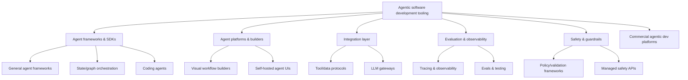
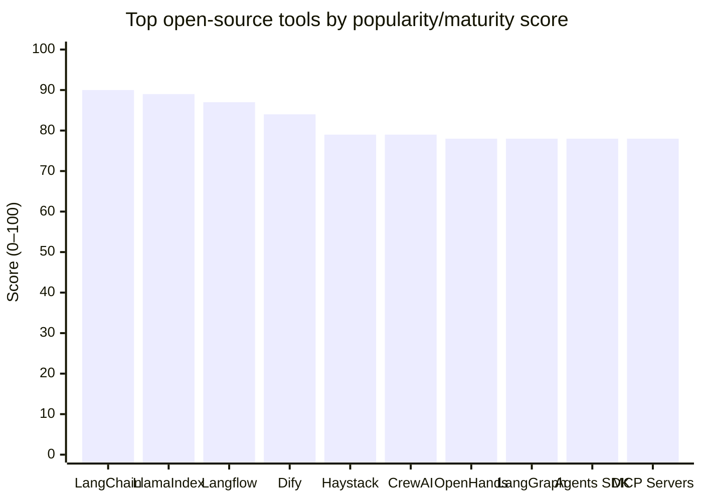

# Awesome List of Agentic Software Development Tools

## Executive summary

This report curates a pragmatic “awesome list” of the most popular open‑source and commercial tools used to build **agentic software development** systems: agents that can plan, call tools, iterate, collaborate with other agents, and ship changes to real codebases (often with human review gates). Metrics and product facts are current **as of mid‑February 2026 (Europe/London)** using primary/official sources whenever possible.

**Top picks by category (why they’re top):**

**Agent frameworks and SDKs (code-first)**
- **LangChain** and **LlamaIndex** remain the most widely adopted general-purpose ecosystems (very large GitHub communities; frequent releases). citeturn2view0turn2view4  
- **LangGraph** stands out for stateful, graph-based agent orchestration (strong “used by” signal and rapid releases). citeturn6view0  
- **OpenAI Agents SDK** and **Google ADK** are the most prominent “vendor-authored but model-agnostic” SDKs with strong recent release activity. citeturn29view0turn29view1  
- **Microsoft Agent Framework** reflects consolidation of enterprise orchestration patterns across .NET and Python (newer but fast-moving; strong official backing). citeturn39view0turn38search5  

**Agent platforms and builders (UI/low-code + deployment)**
- **Langflow** and **Dify** are the largest “build/host agent workflows” open-source platforms by GitHub popularity and ongoing releases. citeturn34view2turn35view0  
- **Open WebUI** is a breakout self-hosted interface/platform with extremely high GitHub adoption and frequent releases. citeturn34view4  

**Integration layer (tools, connectors, and gateways)**
- **Model Context Protocol (MCP)** has become the dominant open integration standard for tool/data connectivity (very high GitHub popularity; active releases). citeturn26search6turn29view2  
- **LiteLLM** is a common “LLM gateway” for standardising provider calls, tracking cost, and applying guardrails. citeturn28view3  

**Evaluation, observability, and testing**
- **Langfuse** and **Arize Phoenix** lead open-source observability/tracing platforms with frequent releases. citeturn16view0turn17view0  
- **Promptfoo** is a fast-evolving CLI for evals and red teaming, designed for CI/CD. citeturn16view2turn15view2  
- **Ragas** and **DeepEval** are among the most adopted evaluation frameworks for RAG/agentic systems. citeturn16view3turn20view0  

**Safety and guardrails**
- **NVIDIA NeMo Guardrails** and **Guardrails AI** are the most established open-source guardrail toolkits in active development. citeturn22view0turn23view0  
- **Prompt Shields (Azure AI Content Safety)** is a representative example of a managed/policy product for jailbreak/prompt-injection style attacks. citeturn21search3turn21search15  

**Commercial / managed platforms used in agentic development**
- **GitHub Copilot Agents / Agent HQ** is the centre of gravity for “agents inside the developer workflow” with very large disclosed adoption. citeturn31search7turn37search0turn37search16  
- **OpenAI Responses API** is a major developer surface for building tool-using, “agent-like” apps with built‑in tools and a published Assistants API sunset. citeturn36search3turn36search11turn36search5  
- **Microsoft Copilot Studio** and **Azure AI Foundry Agent Service** provide low‑code + hosted agent runtimes for enterprises. citeturn31search6turn36search4turn36search18  
- **Vertex AI Agent Builder** and **Amazon Bedrock Agents** are the leading “cloud suite” equivalents on Google Cloud and AWS. citeturn36search0turn30search2  
- **Cursor** and **Devin** represent commercial “agentic coding” products with explicit agent features and pricing/GA statements. citeturn37search2turn30search11turn30search1  

**Scoring methodology (what the numbers mean):**
- Open-source tools receive a **Popularity/Maturity Score (0–100)** computed from public GitHub signals: stars, forks, releases, release recency, contributors, and (when available) “Used by”. Scores are therefore **data-driven but conservative when metrics are unavailable** (missing fields are treated as “unspecified” and do not add points). The underlying GitHub metrics are cited at point of use.
- Commercial products receive a **Maturity Score (0–100)** based on disclosed adoption (if available), vendor backing, documented capabilities, and product status (preview/GA) using official pages when available. The supporting evidence is cited per product.

## Methodology and scoring model

### Sources and inclusion criteria
Tools were included if they materially support **building, operating, testing, or safeguarding agentic systems that touch software development workflows**—including general agent frameworks, coding agents, orchestration/builders, integration standards, observability/evaluation, and guardrails.

Primary sources prioritised:
- GitHub repositories and release pages for open-source metrics and activity.
- Official product documentation from entity["company","OpenAI","ai research company"], entity["company","Microsoft","technology company"], entity["company","Google","technology company"], entity["company","Amazon Web Services","cloud provider"], and entity["company","GitHub","code hosting platform"] for managed agent platforms and APIs. citeturn36search3turn31search6turn36search0turn30search2turn37search16  
- Selected official vendor pages for commercial tooling (e.g., Cursor changelog; Devin pricing). citeturn37search2turn30search1  

### Open-source popularity/maturity score
**Score (0–100)** is computed from the following components (higher is better):
- Stars (max 35, log-scaled)  
- Forks (max 15, log-scaled)  
- Release count (max 10, log-scaled)  
- Release recency (max 20; decays to 0 after ~6 months without release)  
- Contributors (max 10, log-scaled)  
- “Used by” (max 10, log-scaled, when available)  

This design favours projects that are both **widely adopted** and **actively maintained**. It will under-score projects that do not use GitHub releases or do not expose “Used by”.

### Commercial maturity score
Commercial scores are heuristic and are explained per tool using cited evidence (adoption where disclosed, preview/GA language, breadth of documented capabilities, and vendor backing). In commercial categories, several standard open metrics (stars/forks) are naturally **unspecified**.

## Taxonomy and reference architecture

### Taxonomy of agentic development tooling



### Reference architecture for an “agentic SDLC” stack

```mermaid
flowchart LR
  U[Developer / User] --> IDE[IDE or Chat UI]
  IDE --> ORCH[Agent Orchestrator<br/>(LangGraph / Agents SDK / ADK)]
  ORCH --> LLM[LLM Provider(s)]
  ORCH --> TOOLS[Tools & Data]
  TOOLS --> MCP[MCP tool servers]
  TOOLS --> REPO[Code repo + CI]
  TOOLS --> ART[Artifacts<br/>(patches/tests/docs)]

  ORCH --> SAFE[Guardrails layer<br/>(policy + validation)]
  SAFE --> ORCH

  ORCH --> OBS[Tracing & Observability<br/>(Langfuse / Phoenix)]
  ORCH --> EVAL[Offline eval & CI gates<br/>(Promptfoo / Ragas / DeepEval)]

  EVAL --> REPO
  OBS --> DASH[Dashboards + Alerts]
```

### Visual comparison chart for leading open-source tools
The chart below visualises the computed open-source score for a handful of top tools (table values remain the source of truth).



## Open-source agent frameworks and SDKs

### Metrics table for major frameworks
All values are from GitHub repository pages (mid‑February 2026). Citations are embedded per tool.

| Tool | Score | Stars | Forks | Open issues | Releases | Latest release | Days since release | Contributors | Used by |
|---|---:|---:|---:|---:|---:|---:|---:|---:|---:|
| LangChain citeturn2view0 | 90 | 125k | 19.6k | 1.8k | 1.2k | 2026-02-15 | 1 | 9.6k | unspecified |
| LlamaIndex citeturn2view4 | 89 | 44.2k | 6.4k | 38 | 405 | 2026-02-15 | 1 | 916 | 5.6k |
| LangGraph citeturn6view0 | 78 | 11.1k | 1.7k | 214 | 266 | 2026-02-15 | 1 | 395 | 8.4k |
| CrewAI citeturn2view3 | 79 | 30.7k | 4.1k | 499 | 48 | 2026-01-30 | 17 | 148 | 4.4k |
| AutoGen citeturn2view2 | 67 | 53.3k | 7.9k | 57 | 73 | 2025-09-30 | 139 | 132 | 790 |
| Semantic Kernel citeturn9view0 | 74 | 27.2k | 4.5k | 443 | 253 | 2026-02-10 | 6 | 429 | unspecified |
| Microsoft Agent Framework citeturn39view0turn38search3 | 61 | 7.2k | 1.2k | 580 | 56 | 2026-02-13 | 3 | 105 | unspecified |
| OpenAI Agents SDK (Python) citeturn29view0turn26search4 | 78 | 19k | 3.2k | 86 | 57 | 2026-02-13 | 3 | 218 | 4.5k |
| Google ADK (Python) citeturn29view1turn26search5 | 76 | 17.7k | 2.9k | 367 | 38 | 2026-02-11 | 5 | 237 | 3.2k |
| Smolagents citeturn6view1turn4view2 | 66 | 25.5k | 2.3k | 96 | 34 | 2026-01-16 | 31 | 205 | unspecified |
| Haystack citeturn9view1 | 79 | 24.2k | 2.6k | 101 | 208 | 2026-02-12 | 4 | 331 | 1.3k |
| DSPy citeturn8view2 | 67 | 32.2k | 2.6k | unspecified | 106 | 2026-02-05 | 11 | unspecified | unspecified |
| MetaGPT citeturn6view2 | 59 | 64.2k | 8.1k | 76 | 22 | 2024-04-22 | 665 | 113 | 120 |
| OpenAI Swarm citeturn11view3 | 39 | 21k | 2.2k | 11 | 0 | unspecified | unspecified | 14 | unspecified |

### Tool notes
Each entry includes (a) what it does, (b) score + evidence, (c) homepage link.

#### LangChain
- General-purpose Python framework for building LLM applications including agent/tool abstractions and retrieval/RAG patterns. citeturn31search15  
- Huge ecosystem momentum and frequent releases (125k stars; 1,160 releases; latest release 2026-02-15). citeturn2view0  
- Often paired with LangGraph for more explicit state and control in production agents. citeturn6view0  
**Popularity/Maturity Score:** 90/100 (GitHub metrics above). citeturn2view0  
**Homepage:** `https://github.com/langchain-ai/langchain`

#### LlamaIndex
- Data/knowledge framework focused on getting external data into LLM apps (indexing, retrieval, query engines) and agentic patterns around those primitives. citeturn1view3turn31search2  
- Strong adoption and active releases (44.2k stars; 405 releases; latest 2026-02-15; “Used by” ~5.6k repos). citeturn2view4  
- Commercial “LlamaCloud” extends document processing and workflow automation around the open-source core. citeturn31search8turn31search2  
**Popularity/Maturity Score:** 89/100. citeturn2view4  
**Homepage:** `https://github.com/run-llama/llama_index`

#### LangGraph
- Graph/state-machine oriented orchestration for long-running, multi-step agents (explicit state, transitions, and control). citeturn6view0  
- Notable production signals: high “Used by” (~8.4k) and very frequent releases (266 total; latest 2026-02-15). citeturn6view0  
- A common pattern is “LangChain for components + LangGraph for control-flow”. citeturn6view0  
**Popularity/Maturity Score:** 78/100. citeturn6view0  
**Homepage:** `https://github.com/langchain-ai/langgraph`

#### CrewAI
- Multi-agent collaboration framework: define agent roles, assign tasks, coordinate tool use in a “crew”. citeturn2view3  
- Strong adoption and active releases (30.7k stars; latest release 2026-01-30; “Used by” ~4.4k). citeturn2view3  
- Practical for role-based workflows (researcher/engineer/reviewer) with human approvals. citeturn2view3  
**Popularity/Maturity Score:** 79/100. citeturn2view3  
**Homepage:** `https://github.com/crewAIInc/crewAI`

#### AutoGen
- Framework for building chat-/tool-driven multi-agent systems, initially popularised for agent collaboration patterns. citeturn2view2  
- Very large star count, but release recency lags compared to the most active peers (latest release shown 2025-09-30). citeturn2view2  
- Often used for research and prototyping multi-agent dialogue and coordination. citeturn2view2  
**Popularity/Maturity Score:** 67/100. citeturn2view2  
**Homepage:** `https://github.com/microsoft/autogen`

#### Semantic Kernel
- SDK for integrating LLM “skills/functions” into applications with an emphasis on enterprise-friendly patterns and connectors. citeturn9view0  
- High ongoing activity (253 releases; latest 2026-02-10) and broad community adoption. citeturn9view0  
- Frequently positioned alongside Microsoft’s newer Agent Framework as the ecosystem evolves. citeturn38search3turn39view0  
**Popularity/Maturity Score:** 74/100. citeturn9view0  
**Homepage:** `https://github.com/microsoft/semantic-kernel`

#### Microsoft Agent Framework
- Unifies orchestration concepts as a successor to Semantic Kernel + AutoGen, targeting both Python and .NET with graph-based workflows and Dev UI support. citeturn39view0turn38search3  
- Actively shipping (latest release shown 2026-02-13) with official positioning as an “open-source SDK and runtime”. citeturn39view0turn38search5  
- Designed to integrate telemetry (OpenTelemetry), middleware, multi-provider support, and workflow orchestration. citeturn39view0  
**Popularity/Maturity Score:** 61/100. citeturn39view0  
**Homepage:** `https://github.com/microsoft/agent-framework`

#### OpenAI Agents SDK
- Lightweight primitives for building agentic apps: agents with tools/guardrails/handoffs, plus tracing UI; positioned as a production-ready upgrade over Swarm. citeturn27view0turn26search4turn29view0  
- Strong ongoing releases (57 releases; latest 2026-02-13; “Used by” ~4.5k). citeturn29view0  
- Official documentation and developer guide available via OpenAI API docs. citeturn26search8turn26search4  
**Popularity/Maturity Score:** 78/100. citeturn29view0  
**Homepage:** `https://github.com/openai/openai-agents-python`

#### Google Agent Development Kit
- Code-first framework for building, evaluating, deploying agents; emphasises “software engineering principles” and modularity; optimised for Gemini but described as model-agnostic. citeturn27view1turn26search5turn29view1  
- High activity (latest release shown 2026-02-11; “Used by” ~3.2k). citeturn29view1  
- Closely aligned with Google’s Vertex AI Agent Builder lifecycle and deployment services. citeturn36search0turn36search1  
**Popularity/Maturity Score:** 76/100. citeturn29view1  
**Homepage:** `https://github.com/google/adk-python`

#### Smolagents
- Compact agent framework authored in the Hugging Face ecosystem, oriented to practical tool use with minimal abstraction. citeturn4view2  
- Active maintenance (latest release shown 2026-01-16). citeturn6view1  
- Often used when teams want a smaller surface area than “kitchen sink” frameworks. citeturn4view2  
**Popularity/Maturity Score:** 66/100. citeturn6view1  
**Homepage:** `https://github.com/huggingface/smolagents`

#### Haystack
- Pipeline framework for LLM apps with strong grounding in retrieval and production deployments; supports agentic patterns and integrations. citeturn9view1turn15view1  
- Consistent maintenance (208 releases; latest 2026-02-12; “Used by” ~1.3k). citeturn9view1  
- Works well as a structured “component pipeline” baseline when you want less free-form agency. citeturn9view1  
**Popularity/Maturity Score:** 79/100. citeturn9view1  
**Homepage:** `https://github.com/deepset-ai/haystack`

#### DSPy
- “Programming” approach for LLM pipelines (optimisation/compilation mindset), frequently used to improve prompting and retrieval components that agents rely on. citeturn8view2turn15view1  
- Active release stream (latest 2026-02-05) with strong adoption (32.2k stars). citeturn8view2  
- Common as a component-level optimisation layer underneath an agent orchestrator. citeturn8view2  
**Popularity/Maturity Score:** 67/100. citeturn8view2  
**Homepage:** `https://github.com/stanfordnlp/dspy`

#### MetaGPT
- Multi-agent framework that simulates a “software company” (agents in specialised roles) to execute software tasks. citeturn6view2turn5view2  
- Very high popularity (64.2k stars) but lower recency signal (latest release shown 2024-04-22). citeturn6view2  
- Useful as a reference for role-based multi-agent planning, even if you adopt different production tooling. citeturn6view2  
**Popularity/Maturity Score:** 59/100. citeturn6view2  
**Homepage:** `https://github.com/geekan/MetaGPT`

#### OpenAI Swarm
- Educational multi-agent orchestration framework; explicitly labelled educational and has no releases published. citeturn11view3  
- Important historically because later OpenAI agent tooling positions itself as a production upgrade. citeturn26search4turn11view3  
- Still useful to understand minimal “handoff” style orchestration patterns. citeturn11view3  
**Popularity/Maturity Score:** 39/100. citeturn11view3  
**Homepage:** `https://github.com/openai/swarm`

## Open-source agent platforms and builders

### Metrics table for platforms/builders
| Tool | Score | Stars | Forks | Open issues | Releases | Latest release | Days since release |
|---|---:|---:|---:|---:|---:|---:|---:|
| Langflow citeturn34view2turn33view0 | 87 | 145k | 8.5k | unspecified | 280 | 2026-01-23 | 24 |
| Dify citeturn35view0 | 84 | 130k | 20.2k | 399 | 158 | 2026-02-11 | 5 |
| Flowise citeturn34view3turn33view2 | 71 | 49.1k | 23.7k | 644 | 80 | 2026-02-03 | 13 |
| Open WebUI citeturn34view4turn33view3 | 77 | 124k | 17.5k | 169 | 146 | 2026-02-16 | 0 |

### Tool notes

#### Langflow
- Visual builder for agents/workflows; supports deploying flows as APIs and as MCP servers (turning workflows into tools usable by MCP clients). citeturn33view0  
- Extremely large GitHub adoption with frequent releases (145k stars; latest 2026-01-23). citeturn34view2  
- Useful when teams want rapid prototyping plus a deployment story without writing all orchestration code by hand. citeturn33view0  
**Popularity/Maturity Score:** 87/100. citeturn34view2  
**Homepage:** `https://github.com/langflow-ai/langflow`

#### Dify
- Self-hostable platform for building LLM apps with agentic workflows, RAG pipelines, model management, and observability features. citeturn33view1turn35view0  
- Strong “platform maturity” signals: very large repo, frequent releases (latest 2026-02-11), and very high star count (130k). citeturn35view0  
- Notable licensing nuance: “Dify Open Source License” based on Apache 2.0 with additional conditions. citeturn34view0  
**Popularity/Maturity Score:** 84/100. citeturn35view0  
**Homepage:** `https://github.com/langgenius/dify`

#### Flowise
- Low-code node/graph UI to “build AI agents visually” with local/self-host options and a commercial cloud offering. citeturn33view2  
- Very large adoption and frequent releases (49.1k stars; latest 2026-02-03). citeturn34view3  
- Valuable for teams that need a UI-native workflow builder and a shareable “flow graph” artefact. citeturn33view2  
**Popularity/Maturity Score:** 71/100. citeturn34view3  
**Homepage:** `https://github.com/FlowiseAI/Flowise`

#### Open WebUI
- Self-hosted AI interface/platform supporting offline operation and multiple LLM backends (Ollama and OpenAI-compatible APIs) with built-in RAG support. citeturn33view3turn32search7  
- Extremely high GitHub adoption with frequent releases (124k stars; latest release 2026-02-16). citeturn34view4  
- Positions an enterprise plan alongside the open-source project (SLA/LTS etc.). citeturn33view3  
**Popularity/Maturity Score:** 77/100. citeturn34view4  
**Homepage:** `https://github.com/open-webui/open-webui`

## Integration and orchestration infrastructure

### Metrics table
| Tool | Score | Stars | Forks | Releases | Latest release | Open issues |
|---|---:|---:|---:|---:|---:|---:|
| MCP Servers citeturn29view2 | 78 | 78.8k | 9.5k | 24 | 2026-01-27 | 233 |
| LiteLLM citeturn28view3turn27view3 | 74 | 36.1k | 5.8k | 1,182 | 2026-02-15 | unspecified |

### Tool notes

#### Model Context Protocol servers
- Reference implementations and a directory/registry pointer for MCP servers (standardised tool/data access for AI applications). citeturn27view2turn29view2  
- Explicit warning that reference servers are educational and not necessarily production-ready; users should evaluate their threat model. citeturn27view2  
- Managed by Anthropic “built together with the community” and has very strong GitHub adoption. citeturn29view2turn26search6  
**Popularity/Maturity Score:** 78/100. citeturn29view2  
**Homepage:** `https://github.com/modelcontextprotocol/servers`

#### LiteLLM
- Unifies calls to 100+ LLM APIs behind an OpenAI-format interface; also offers a proxy server (“AI gateway”) with cost tracking, guardrails, load-balancing, and logging. citeturn27view3turn28view3  
- Extremely active release cadence (1,182 releases; latest 2026-02-15). citeturn28view3  
- Often used as the “provider abstraction” underneath agents so you can swap models/providers without rewriting tool logic. citeturn27view3  
**Popularity/Maturity Score:** 74/100. citeturn28view3  
**Homepage:** `https://github.com/BerriAI/litellm`

## Evaluation, observability, and testing

### Metrics table
| Tool | Score | Stars | Forks | Open issues | Releases | Latest release |
|---|---:|---:|---:|---:|---:|---:|
| Langfuse citeturn16view0turn15view0 | 68 | 22k | 2.2k | unspecified | 532 | 2026-02-12 |
| Arize Phoenix citeturn17view0turn16view1 | 64 | 8.6k | 720 | 286 | 613 | 2026-02-14 |
| Promptfoo citeturn16view2turn14search2 | 71 | 10.5k | 920 | 85 | 392 | 2026-02-10 |
| Ragas citeturn16view3turn15view3 | 71 | 12.6k | 1.2k | 266 | 89 | 2026-01-13 |
| DeepEval citeturn20view0turn19view0 | 61 | 13.7k | 1.2k | 207 | 53 | 2025-12-01 |
| TruLens citeturn20view1turn18search13 | 57 | 3.1k | 249 | 20 | 114 | 2026-02-04 |
| Giskard citeturn20view2turn19view2 | 56 | 5.1k | 394 | 30 | 83 | 2026-02-10 |
| OpenAI Evals citeturn19view3 | 44 | 17.7k | 2.9k | 113 | unspecified | unspecified |

### Tool notes

#### Langfuse
- Open-source LLM engineering platform: observability/tracing, prompt management, evaluations, datasets, and playground. citeturn15view0turn16view0  
- Very active releases (latest 2026-02-12) and strong adoption (22k stars). citeturn16view0  
- Designed to integrate with multiple frameworks/providers (listed integrations and ecosystem references are part of its positioning). citeturn15view0  
**Popularity/Maturity Score:** 68/100. citeturn16view0  
**Homepage:** `https://github.com/langfuse/langfuse`

#### Arize Phoenix
- Open-source AI observability platform for tracing, evaluation, datasets, experiments, and prompt management; supports OpenTelemetry-based instrumentation. citeturn15view1turn17view0  
- Very active release stream (latest 2026-02-14). citeturn17view0  
- Uses Elastic License 2.0 and includes patent notice language—important for some enterprise legal reviews. citeturn17view0  
**Popularity/Maturity Score:** 64/100. citeturn17view0  
**Homepage:** `https://github.com/Arize-ai/phoenix`

#### Promptfoo
- Developer-friendly CLI and local tooling for LLM evals, comparative testing, and red teaming/vulnerability scanning; supports CI/CD workflows. citeturn15view2turn16view2  
- Extremely active releases (392 total; latest 2026-02-10). citeturn16view2  
- Useful as a “tests for prompts/agents” layer that can gate merges in PR pipelines. citeturn15view2  
**Popularity/Maturity Score:** 71/100. citeturn16view2  
**Homepage:** `https://github.com/promptfoo/promptfoo`

#### Ragas
- Toolkit for evaluating and optimising LLM apps (especially RAG), including test dataset generation and objective metrics. citeturn15view3turn16view3  
- Strong adoption and active releases (12.6k stars; latest 2026-01-13; “Used by” ~3.4k). citeturn16view3  
- Often used alongside observability tools to create feedback loops from production traces back into offline eval sets. citeturn15view3  
**Popularity/Maturity Score:** 71/100. citeturn16view3  
**Homepage:** `https://github.com/vibrantlabsai/ragas`

#### DeepEval
- Open-source evaluation framework for unit-testing LLM outputs (Pytest-like) and for evaluating RAG and agentic workflows with LLM-as-a-judge metrics. citeturn19view0turn20view0  
- Substantial adoption (13.7k stars) and ongoing releases (latest shown Dec 2025). citeturn20view0  
- Also marketed with an optional cloud platform for storing/comparing test results. citeturn19view0  
**Popularity/Maturity Score:** 61/100. citeturn20view0  
**Homepage:** `https://github.com/confident-ai/deepeval`

#### TruLens
- Instrumentation and evaluation framework for LLM experiments/agents, designed to help teams “systematically evaluate and track” app behaviour. citeturn19view1turn20view1  
- Active releases with a recent 2.6.0 (2026-02-04). citeturn20view1turn18search13  
- Practical when you want a library-first approach with an accompanying UI workflow. citeturn19view1  
**Popularity/Maturity Score:** 57/100. citeturn20view1  
**Homepage:** `https://github.com/truera/trulens`

#### Giskard
- Testing/evaluation framework for AI systems (LLM agents and traditional ML) focusing on performance, bias, and security issues (e.g., prompt injection, sensitive disclosure). citeturn19view2turn20view2  
- Active releases (latest 2026-02-10). citeturn20view2  
- Useful as a “risk scanning” layer for agent outputs and RAG answers, complementing classic eval metrics. citeturn19view2  
**Popularity/Maturity Score:** 56/100. citeturn20view2  
**Homepage:** `https://github.com/Giskard-AI/giskard-oss`

#### OpenAI Evals
- Framework and registry for evaluating LLMs and LLM systems, including custom eval definition and contribution model. citeturn19view3  
- Substantial adoption (17.7k stars; 2.9k forks), but public release signalling is less explicit in the surfaced repository metadata. citeturn19view3  
- Useful as a reference harness and benchmark registry, especially if you align closely with OpenAI model families. citeturn19view3  
**Popularity/Maturity Score:** 44/100 (score is conservative due to unspecified release metadata). citeturn19view3  
**Homepage:** `https://github.com/openai/evals`

## Safety and guardrails

### Tool notes

#### NeMo Guardrails
- Open-source toolkit for adding programmable “rails” to LLM conversational systems (topic control, dialog paths, extraction, etc.). citeturn22view0turn21search0  
- Includes an evaluation tool (`nemoguardrails evaluate`) and discussion of vulnerability scanning (jailbreak/prompt injection). citeturn22view0  
- Actively maintained (latest release shown 2026-01-22). citeturn22view0  
**Popularity/Maturity Score:** 57/100. citeturn22view0  
**Homepage:** `https://github.com/NVIDIA-NeMo/Guardrails`

#### Guardrails AI
- Python framework for input/output validation to mitigate specific risks, plus structured data generation; hub-based validator ecosystem. citeturn22view1turn23view0  
- Active releases with recent v0.8.1 (2026-02-13). citeturn23view0  
- Often used to enforce schemas, detect risk categories, or apply transformations before results reach users. citeturn22view1  
**Popularity/Maturity Score:** 58/100. citeturn23view0  
**Homepage:** `https://github.com/guardrails-ai/guardrails`

#### LLM Guard
- Security toolkit focused on scanning/sanitising LLM inputs/outputs (harmful language, data leakage, prompt injection). citeturn22view2turn23view1turn25search4  
- GitHub adoption is smaller than the main guardrails frameworks (2.5k stars) and release signalling is not prominent in the surfaced repo metadata. citeturn23view1  
- Useful as a composable “scanner set” in front of/behind an agent, especially for compliance-style filters. citeturn22view2  
**Popularity/Maturity Score:** 29/100 (conservative due to unspecified releases). citeturn23view1  
**Homepage:** `https://github.com/protectai/llm-guard`

#### Prompt Shields
- Managed detection/mitigation API for adversarial prompt attacks, positioned as a unified API in Azure AI Content Safety. citeturn21search3turn21search15  
- Evidence of ongoing product updates in documentation timestamps (e.g., updated Jan 2026 for jailbreak/prompt-attack guidance). citeturn21search3  
- Best used as a layered defence alongside application-level guardrails and continuous evals (guardrails are not “set and forget”). citeturn21search3turn21news37  
**Commercial Maturity Score:** 80/100 (managed service + official docs + continuous updates). citeturn21search3turn21search7  
**Homepage:** `https://learn.microsoft.com/azure/ai-services/content-safety/concepts/jailbreak-detection`

## Commercial platforms and managed services for agentic development

### GitHub Copilot Agents and Agent HQ
- Adds “coding agents” natively inside GitHub and VS Code workflows, including choosing among Copilot and third-party agents (e.g., Claude and Codex) via Agent HQ. citeturn37search0turn37search16turn37search13  
- Evidence of large adoption: Microsoft’s annual report states GitHub Copilot has **more than 20 million users**. citeturn31search7  
- Official descriptions cover agent mode / coding agents and repository-level enablement controls. citeturn37search12turn37search13  
**Commercial Maturity Score:** 92/100 (very large disclosed adoption + deep IDE/repo integration + ongoing rollout). citeturn31search7turn37search0turn37search16  
**Homepage:** `https://github.com/features/copilot/agents`

### OpenAI Responses API
- A unified API designed for “agent-like applications” with built-in tools (web search, file search, computer use, code interpreter, remote MCPs) and multi-turn interactions. citeturn36search3turn36search5  
- Public deprecation notice: Assistants API removal planned **August 26, 2026** (one-year notice from Aug 26, 2025 per the deprecations page). citeturn36search11  
- Positioned as part of “new tools for building agents,” including tooling to evaluate agent performance. citeturn36search5  
**Commercial Maturity Score:** 88/100 (clear roadmap + built-in tools + published deprecation timeline). citeturn36search3turn36search11turn36search5  
**Homepage:** `https://developers.openai.com/api/docs/guides/migrate-to-responses/`

### Microsoft Copilot Studio
- Low-code environment to create and deploy agents via a guided graphical experience; official docs include “create and deploy an agent” quickstarts. citeturn31search9turn31search6  
- “Agent Builder” capabilities are processed by Copilot Studio service and can involve data flow to/from Microsoft 365 and Copilot Studio (important for governance reviews). citeturn31search3  
- Adds capabilities like “computer use” style automation for apps/websites when APIs don’t exist (reported in mainstream coverage, but product docs remain primary for governance). citeturn31news37turn31search6  
**Commercial Maturity Score:** 86/100 (enterprise backing + strong docs + broad automation scope). citeturn31search6turn31search9  
**Homepage:** `https://learn.microsoft.com/microsoft-copilot-studio/`

### Azure AI Foundry Agent Service
- Fully managed Azure service for creating/configuring/running agents that pair LLMs with tools and execution logic. citeturn36search4turn36search2  
- Azure positions it as “orchestrate and host AI agents” and offers REST API references (clear production surface). citeturn36search2turn36search4  
- Connects naturally with Azure governance and security tooling (implied by service positioning; evaluate fit in your Azure architecture review). citeturn36search18turn36search4  
**Commercial Maturity Score:** 84/100 (managed runtime + enterprise docs + API surface). citeturn36search18turn36search4  
**Homepage:** `https://azure.microsoft.com/products/ai-foundry/agent-service`

### Vertex AI Agent Builder
- Google Cloud “suite of products” to build, scale, and govern agents across the lifecycle; explicitly supports building with ADK or other frameworks. citeturn36search0turn36search1  
- Product and docs describe a full-stack foundation (build/scale/govern) and connect to additional services like Agent Engine. citeturn36search0turn36search17  
- Designed for enterprise-grade deployments grounded in enterprise data. citeturn36search1  
**Commercial Maturity Score:** 85/100 (major cloud backing + explicit lifecycle coverage + official docs). citeturn36search0turn36search1  
**Homepage:** `https://cloud.google.com/products/agent-builder`

### Amazon Bedrock Agents
- AWS-managed agent capability: orchestrates interactions among foundation models, data sources/knowledge bases, user conversations, and automatically calls APIs for actions. citeturn30search2turn30search5  
- Official docs cover how agents work and how they integrate with broader Bedrock features. citeturn30search5turn30search12  
- AWS frames a path to production via additional platform components such as “AgentCore” in its documentation narrative. citeturn30search5  
**Commercial Maturity Score:** 84/100 (managed agent surface + major cloud backing + documentation depth). citeturn30search2turn30search5  
**Homepage:** `https://docs.aws.amazon.com/bedrock/latest/userguide/agents.html`

### LangSmith
- Observability/tracing product positioned as an “AI agent and LLM observability platform” with debugging/monitoring and cost/latency tracking. citeturn31search13turn31search15  
- Often paired with LangChain/LangGraph projects given ecosystem alignment. citeturn31search13turn31search15  
- Complements open tools (Promptfoo/Ragas/DeepEval) by providing production workflows and dashboards. citeturn31search13  
**Commercial Maturity Score:** 83/100 (ecosystem centrality + production focus + mature product positioning). citeturn31search13turn31search15  
**Homepage:** `https://www.langchain.com/langsmith/observability`

### Cursor
- Commercial coding environment that is explicitly shipping agent features like “Agent Skills” defined in `SKILL.md` files usable in editor and CLI. citeturn37search2turn37search8  
- Publishes frequent changelog updates describing agent capability evolution. citeturn37search2turn30search10  
- Reported enterprise internal usage exists (e.g., large-scale adoption in a major engineering org), but treat external reports as directional rather than definitive performance proof. citeturn30news40turn30news41  
**Commercial Maturity Score:** 82/100 (rapid product iteration + explicit agent primitives + strong market traction signals). citeturn37search2turn30search10  
**Homepage:** `https://cursor.com/changelog`

### Devin
- Commercial “AI coding agent” marketed as generally available for teams, with explicit collaboration surfaces (Slack integration, IDE extension, API). citeturn30search11  
- Pricing model is documented publicly (pay‑as‑you‑go ACU-based pricing with minimums, plus higher tiers). citeturn30search1turn30search11  
- Represents a high-autonomy segment of the market (agent completes tasks, not just suggestions), so evaluation/guardrails requirements tend to be higher in practice. citeturn30search11  
**Commercial Maturity Score:** 78/100 (GA + clear pricing + strong concept fit; adoption metrics not publicly standardised). citeturn30search11turn30search1  
**Homepage:** `https://devin.ai/pricing/`